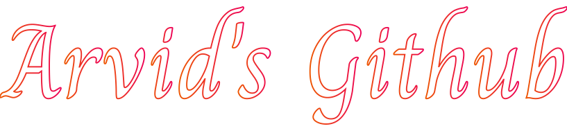

<h1 align="center">Welcome to</h1>

<h1></h1>
<table align="center">
  <tr>
    <td><b><u><a href="README.md">English</a></b></u></td>
    <td><a href="README_no.md">Norwegian</a></td>
    <td><a href="README_de.md">German</a></td>
  </tr>
</table>

<h2 align="center">🌱 I am currently learning:</h2>

<!-- <blockquote align="center">
   Nuxt 
   TypeScript 
   Go 
   PHP 
   Wordpress 
   Docker 
   C# 
   TailwindCSS 
   Transact-SQL 
  And a bunch of other stuff
</blockquote> -->

<h2 align="center">👀 I’m interested in:</h2>
<blockquote align="center">
  Web Development 
  3D Printing 
  3D Modelling 
  new technology 
</blockquote>

<h2 align="center">📫 How to reach me: </h6>
<ul align="center">
  <li align="center">Email - arvidw0310@gmail.com</li>
  <li align="center">EmailV2 - spamarvid0310@gmail.com (Longer response time)</li>
  <li align="center"><a href="https://arvidw.space">On my website (currently not possible)</a></li>
</ul>

<h2 align="center">Some stats about me</h2>

<h2 align="center">My current projects</h2>

<table align="center">
  <tr>
    <th>Name</th>
    <th><a href="https://github.com/ArvidWedtstein/Nuxt-Website">Portfolio</a></th>
    <th><a href="https://github.com/ArvidWedtstein/Website-API">Portfolio API</a></th>
    <th><a href="https://github.com/appex/appex-tournaments">Appex Tournament App</a></th>
    <th><a href="https://github.com/ArvidWedtstein/DiscordbotV13">Discordbot</a></th>
    <th><a href="https://github.com/ArvidWedtstein/Devco">Wordpress Template</a></th>
    <th><a href="https://github.com/ArvidWedtstein/github-embed-generator">Github Embed Generator</a></th>
  </tr>
  <tr>
    <th>Description</th>
    <td>My portfolio. Lists all my projects and tells a little bit about me</td>
    <td>Express API for handling projects, reviews and userdata on my portfolio</td>
    <td>Tournament Bracket App for Appex. Lets you create tournaments.</td>
    <td>Upgrading my old discordbot to DiscordJSV13 since discord shut down the DiscordJS-Commando Framework</td>
    <td>Wordpress template for school project</td>
    <td>Embed Stats Generator for github</td>
  </tr>
  <tr>
    <th>Languages</th>
    <td>Nuxt, Vue, JS</td>
    <td>JS, MongoDB Database</td>
    <td>C#/DotNet for backend API, Nuxt 3 for frontend, MongoDB Database</td>
    <td>JavaScript. (Converting to TypeScript)</td>
    <td>PHP</td>
    <td>Go</td>
  </tr>
</table>
<!-- 

  
  
  

 -->

</h4>😂 Random joke</h4>

