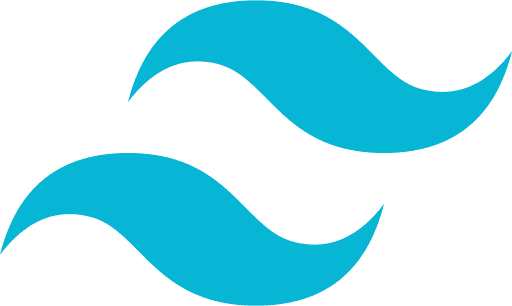

<h1 align="center">Hallo. Ich bin @ArvidWedtstein</h1>

<table align="center">
  <tr>
    <td><a href="README.md">English</a></td>
    <td><a href="README_no.md">Norwegian</a></td>
    <td><b><u><a href="README_de.md">German</a></b></u></td>
  </tr>
</table>

<h2 align="center">🌱 Ich lerne zur zeit:</h2>
<blockquote align="center">
   Nuxt 
   TypeScript 
   PHP 
   Wordpress 
   Docker 
   C# 
   TailwindCSS 
  und vieles mehr
</blockquote>

#### 👀 Ich habe interesse für:
<blockquote align="center">
  Web entwicklung 
  3D drucken 
  3D modellierung 
  neue technologie 
</blockquote>

<h2 align="center">📫 Sie können mich erreichen über: </h6>
<ul align="center">
  <li align="center">Email - arvidw0310@gmail.com</li>
  <li align="center">EmailV2 - spamarvid0310@gmail.com (Längere antworte zeit)</li>
  <li align="center"><a href="https://nuxtarvidw.netlify.app">Auf meiner website (zür zeit nicht möglich)</a></li>
</ul>

<h2 align="center">Ein paar daten über mich:</h2>

<h2 align="center">Meine Projecte</h2>

<table align="center">
  <tr>
    <th>Name</th>
    <th><a href="https://github.com/ArvidWedtstein/Nuxt-Website">Portfolio</a></th>
    <th><a href="https://github.com/ArvidWedtstein/Website-API">Portfolio API</a></th>
    <th><a href="https://github.com/appex/appex-tournaments">Appex Tournament App</a></th>
    <th><a href="https://github.com/ArvidWedtstein/DiscordbotV13">Discordbot</a></th>
    <th><a href="https://github.com/ArvidWedtstein/Devco">Wordpress Template</a></th>
  </tr>
  <tr>
    <th>Beschreibung</th>
    <td>Mein portfolio. Listet alle meine Projekte auf und erzählt ein wenig über mich</td>
    <td>Express API für handling von projecten, reviews und benutzerdaten in meinem portfolio</td>
    <td>Tournament Bracket App für Appex.</td>
    <td>Upgrade meines alten Discordbot auf DiscordJSV13, da Discord das DiscordJS-Commando Framework heruntergefahren hat</td>
    <td>Wordpress template für ein Schul Project</td>
  </tr>
  <tr>
    <th>Sprachen</th>
    <td>Nuxt, Vue, JS</td>
    <td>JS, MongoDB Database</td>
    <td>C#/DotNet für backend API, Nuxt 3 für frontend, MongoDB Database</td>
    <td>JavaScript. (Wird konvertiert zu TypeScript)</td>
    <td>PHP</td>
  </tr>
</table>
<!-- 

  
  
  

 -->

## 😂 Zufälliger joke

##

